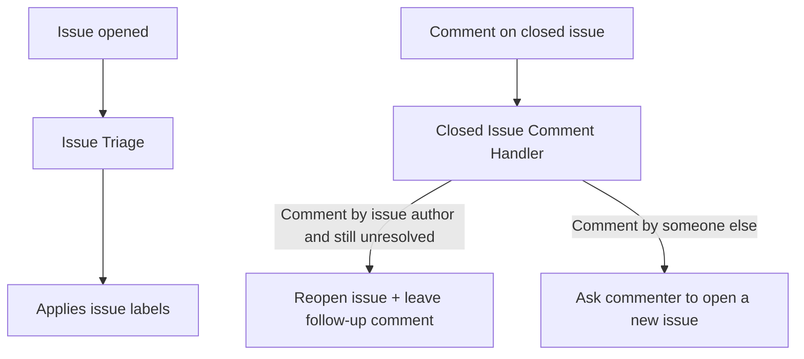
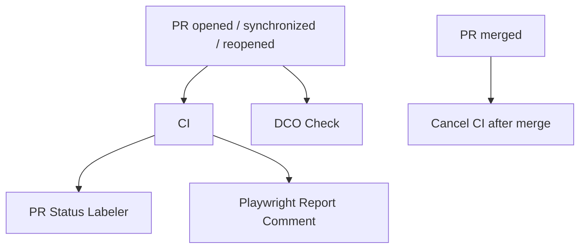

# GitHub Workflows Overview

This directory contains CI/CD, automation, triage, and release workflows.

## Issue Workflow Relationships

## PR Workflow Relationships

## Workflows

| File                         | Name                        | Description                                                                                                                          | Trigger                                                                                                            | Output labels                                                                                                                     |
| ---------------------------- | --------------------------- | ------------------------------------------------------------------------------------------------------------------------------------ | ------------------------------------------------------------------------------------------------------------------ | --------------------------------------------------------------------------------------------------------------------------------- |
| `cancel-ci-after-merge.yml`  | `Cancel CI after merge`     | Cancels still-running or queued `CI` runs for a PR commit after merge.                                                               | `pull_request` on `closed` (only when merged).                                                                     | None.                                                                                                                             |
| `ci.yml`                     | `CI`                        | Runs presubmit checks, type checks, unit tests, build, and Playwright E2E/report merge.                                              | `push` to `main`; `pull_request` on `opened/synchronize/reopened/closed`; or `workflow_dispatch` with `pr_number`. | None.                                                                                                                             |
| `close-stale-prs.yml`        | `Close stale PRs`           | Closes PRs older than two months and leaves an explanatory comment.                                                                  | Daily cron (`0 0 * * *`) or `workflow_dispatch`.                                                                   | None.                                                                                                                             |
| `nightly-runner-cleanup.yml` | `Nightly Runner Cleanup`    | Safely frees disk space on self-hosted runner ci1 (caches, npm, runner \_work).                                                      | Daily cron (4 AM PST); or `workflow_dispatch`.                                                                     | None.                                                                                                                             |
| `playwright-comment.yml`     | `Playwright Report Comment` | Posts a Playwright summary comment on the PR tied to a completed CI run.                                                             | `workflow_run` for `CI` on `completed`.                                                                            | None.                                                                                                                             |
| `dco.yml`                    | `DCO Check`                 | Verifies signed-off commits under the Developer Certificate of Origin.                                                               | `pull_request_target` on `opened/synchronize/reopened`.                                                            | None.                                                                                                                             |
| `pr-status-labeler.yml`      | `PR Status Labeler`         | Applies human-attention labels based on CI outcome and review freshness/verdict.                                                     | `workflow_run` for `CI` on `completed`.                                                                            | Swaps between `needs-human:final-check` (clean + passing) and `needs-human:review-issue` (failing/stale/missing/issueful review). |
| `release-tauri-preview.yml`  | `Release Tauri Preview`     | Manually builds unsigned Tauri desktop bundles and uploads them as workflow artifacts for cutover validation.                        | `workflow_dispatch`.                                                                                               | None.                                                                                                                             |
| `release-tauri.yml`          | `Release Tauri`             | Builds signed/unsigned Tauri release bundles and publishes draft GitHub release assets from the release branch or a manual dispatch. | `push` to `release`; or `workflow_dispatch`.                                                                       | None.                                                                                                                             |

## Nightly Runner Cleanup

The `nightly-runner-cleanup.yml` workflow runs at 4:00 AM PST on self-hosted macOS runner `ci1` to reclaim disk space. It only runs when `RUNNER_NAME == ci1`; other runners skip cleanup.

**Validation (manual run):**

1. Go to Actions → Nightly Runner Cleanup → Run workflow.
2. Confirm the run completes successfully and logs show "Running cleanup on runner: ci1".
3. Check logs for "Disk before" and "Disk after" to verify space reclaimed.
4. On non-ci1 runners, logs should show "Skipping cleanup" and exit successfully.

**Expected behavior:** Deletes only allowlisted paths (npm cache, Playwright browsers, runner \_work dirs older than 2 days, Library/Caches subdirs). Never removes runner binaries, config, or user data outside caches.
